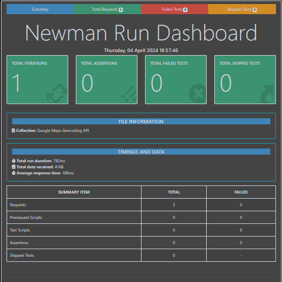

# Google Maps API Testing

This repository contains the test plan, test cases, testing checklist, and example tests for validating the Google Maps API endpoints, specifically focusing on geocoding and nearby search functionalities.

## Test Plan

The test plan outlines the objectives, scope, schedule, and resources for testing the Google Maps API.

## Test Cases

The test cases detail various scenarios to validate the functionality, performance, and reliability of the API endpoints. Each test case includes a description, expected result, and pass/fail criteria.

## Testing Checklist

The testing checklist provides a comprehensive guide for conducting API testing, covering aspects such as headers, API key, request parameters, response validation, and error handling.

## Tools and Services

For implementing the test plan and executing example tests, the following tools and services are utilized:
- Postman: For designing, executing, and validating API requests.
- Newman: For automating the execution of Postman collections.

## Example Tests

Three example tests are provided using Postman to demonstrate the validation of Google Maps API endpoints:
1. Geocode API - Valid Address
2. Nearby Search API - Valid Location and Radius
3. Nearby Search API - Missing Location Parameter

Each example test includes setup instructions, expected results, and observations.

## Usage

To execute the example tests:
1. Clone this repository.
2. Import the Postman collection provided in the `tests` directory.
3. Replace the placeholder API key with your actual Google Maps API key.
4. Execute the tests using Postman or Newman.

## Newman Report

After executing the Postman collection using Newman, a detailed report will be generated. The Newman report provides insights into test execution, including pass/fail statuses, response times, and more. The report is available in the `newman` directory.

## Contributions

Contributions are welcome! If you have suggestions for improvements or additional test cases, please open an issue or submit a pull request.

## License

This project is licensed under the MIT License - see the [LICENSE](LICENSE) file for details.
